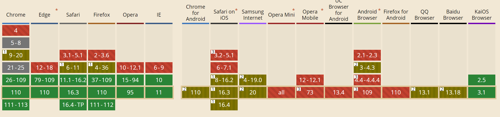
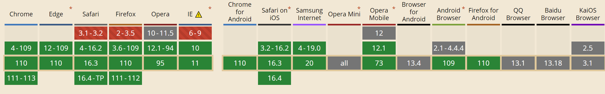
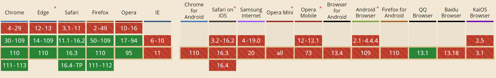

# 文件上传

## 初始化

`npm i` 安装依赖

## 启动

在各自目录 `node server.js` 即可启动项目

> 都开放了静态资源目录，访问打印的网址即可直接加载 `index.html`。
>
> 同时，这样是同源访问，无需跨域。如果需要，可以安装 `npm i cors` 这个包。

## 注意点

### 服务端文件类型检测和大小限制

这两点 demo 中没有做，以后用到需要注意。

###  `accept="image/*"` 

```html
<input id="upload-file" type="file" accept="image/*">
```

上面使用 `accept="image/*"` 限制只选图片，有两个注意点：

- 兼容性
- 用户可以通过改文件后缀绕过，可以通过二级制文件头检查。



### `multiple` 多文件选择兼容性

```html
<input id="upload-file" type="file" accept="image/*" multiple>
```



### `webkitdirectory` 目录上传兼容性

```html
<input id="uploadFile" type="file" accept="image/*" webkitdirectory />
```



如上，只有现代浏览器能用了。另外一点，你选择一个目录，这个目录内的所有层次都会被选择。
